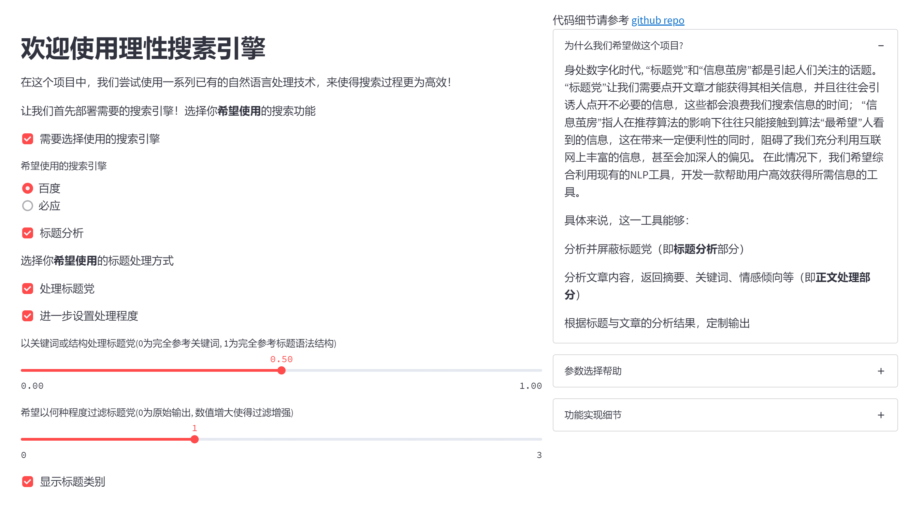

# 深度学习课程项目——理性搜索引擎

## 布置演示
下面视频展示了布置选定功能的搜索引擎的过程。
[](https://cloud.tsinghua.edu.cn/f/041e3f2aac474f19b927/)
（若链接打不开，可以查看 demo.mp4 文件）

## 搜索演示
This video shows the searching process and results.
[](https://cloud.tsinghua.edu.cn/f/b726106a6bee4d39af4c/)
（若链接打不开，可查看 search_demo.mp4 文件）

## 搜索结果
下面是搜搜结果


具体搜索样例请参考 [search_result_for_机器学习.txt](https://github.com/qiuzh20/DL_project/blob/final/search_result_for_%E6%9C%BA%E5%99%A8%E5%AD%A6%E4%B9%A0.txt) 文件（同时也是搜索演示视频对应的结果）。

## 项目细节

具体请参考 [ratinal_search_final](https://github.com/qiuzh20/DL_project/tree/final/rational_search_final) 文件及 [report.pdf](https://github.com/qiuzh20/DL_project/blob/final/Report.pdf)。

### 项目文件树

```shell
rational_search_final
├── Bert_extractive_summarizer  # 基于Bert的提取式摘要生成方法
│   ├── summarizer                  # 依赖文件
│   ├── model_processors.py         # 提取式摘要生成类接口
│   └── README.md                   # 模型原理及部署
├── bert-base-chinese           # 依赖的预训练模型
│    ├── config.json                # 依赖文件参数
│    ├── pytorch_model.bin          # 待下载模型，参考README
│    ├── README.md                  # 预训练模型部署指南
│    └── vocab.txt                  # 模型词表
├── chinese_keyphrase_extractor # 文本关键词提取方法 (注意需解压后安装)
│    ├── README.md                  # 参考配置关键词提取模型
│    └── ......                     # 其它依赖文件
├── Emotion                     # 基于Ernie3.0的文本情感分类方法
│    ├── checkpoints                # 训练checkpoint保存路径
│    │     └── model_800             # 使用的模型（参考README配置）
│    ├── predict.py                 # 情感分析类接口
│    ├── README.md                  # 模型原理及训练方法
│    └── ......                     # 其它依赖文件
├── Ernie                       # 基于Ernie3.0的文本内容分类方法
│    ├── tnews_pruned_infer_model   # 模型（参考README配置）
│    ├── ernie_predictor.py         # 内容分析类接口
│    ├── README.md                  # 模型原理及训练方法
│    └── ......                     # 其它依赖文件
├── GPT2_Summary                # 基于GPT2的生成式摘要生成方法 （注意需解压后配置）
│    ├── summary_model              # 模型参数（参考README配置）
│    ├── interact.py                # 生成式摘要类接口
│    ├── README.md                  # 模型原理及训练方法
│    └── ......                     # 其它依赖文件
├── history                     # 不同版本更新文件
├── knowledge_base              # 基于知识的标题党处理方法
│    ├── grammer_voc.txt            # 语法过滤库材料 
│    └── keywords_voc.txt           # 关键词过滤库材料
├── search                      # 基于网络爬虫的关键词搜索功能
│    ├── history                    # 各版本搜索方法
│    └── search.py                  # 使用的搜索方法
├── search_logs                 # 记录模型载入、搜索、处理等各部分用时
├── search_results              # 以txt格式记录搜索结果
├── modify_search_v1_5.py       # 综合搜索函数
├── README.md                   # 项目使用方法
└── web_app_v2.py               # 基于streamlit的web显示
```
